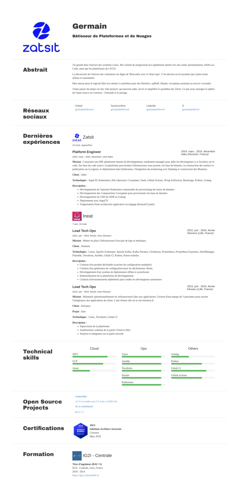

import CodeBlock from "@theme/CodeBlock";
import CVFullExample from "!!raw-loader!@site/static/cv.yml";

# Use a theme

---

Use the flag `--theme=<theme-ame>` to specify the theme you want to use.

To use the theme named `my-theme`:

```bash
cvwonder generate [...] --theme=my-theme
```

The theme must be located in the `themes` directory in the current working directory.

## Default theme

Themes have a specific structure including a `theme.yaml` and an `index.html` file.

```tree
themes
└── default
    ├── theme.yaml  # Theme metadata
    └── index.html  # Theme template
```

To use you theme, specify the theme name with the `--theme` flag.

```bash
cvwonder generate --input=cv.yml --output=generated/ --theme=default
```

### Render

The default theme renders the CV with a simple and clean design.



### CV input

Here is the content of the `cv.yml` file for the rendered CV.

<CodeBlock
  language="yaml"
  description="CV input">
{CVFullExample}
</CodeBlock>
