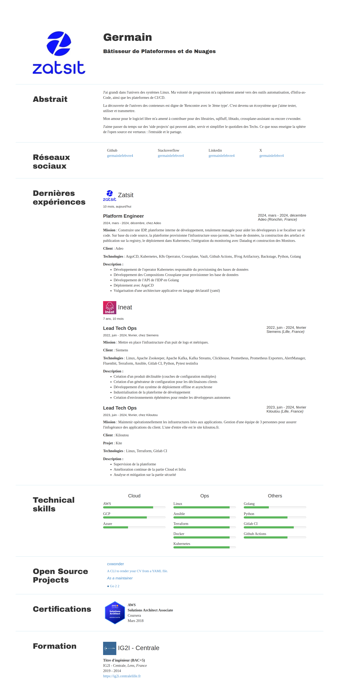

# Use a theme

Use the flag `--theme=<theme-ame>` to specify the theme you want to use.

To use the theme named `my-theme`:

```bash
cvwonder generate [...] --theme=my-theme
```

The theme must be located in the `themes` directory in the current working directory.

## Default theme

```tree
themes
└── default
    ├── theme.yaml  # Theme metadata
    └── index.html  # Theme template
```

```bash
cvwonder generate --input=cv.yml --output=generated/ --theme=default
```

### Render



### CV input

```yaml
{!getting-started/cv.yml!}
```
